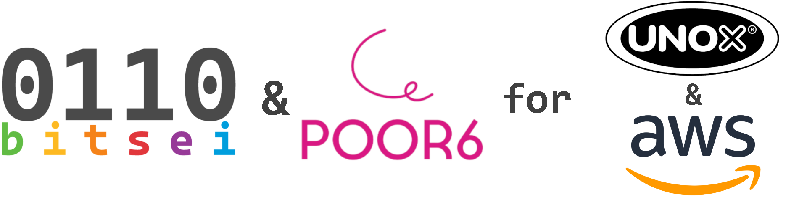

# Unox Generative AI Kitchen Solutions 🍳🤖

Welcome to the repository for our hackathon project, where we harnessed the power of Amazon Generative AI tools to revolutionize the kitchen experience in collaboration with Unox, a leading professional oven manufacturing company. The hackathon, held from Saturday 9/3/2024 to Sunday 10/03/2024, was powered by Amazon AWS and focused on leveraging the Bedrock API to access AWS LLMs and more.

## Hackathon Overview 🚀

- **Host:** Unox, the innovative manufacturing company specializing in professional ovens.
- **Partnership:** In collaboration with Amazon AWS.
- **Theme:** Generative AI, with a primary focus on utilizing Amazon Bedrock API for AWS LLMs.

## Project Assignment 📋

Participants were tasked with enhancing the user experience of the UNOX website, the "Data Driven Cooking" web platform used by professional chefs, or the embedded system of Unox ovens using Amazon Generative AI tools.

## Our Solutions 🌟

### 1. Customer Support Automation 🤖✉️

We automated the customer support process by:

- Crawling Unox website's product manuals.
- Fine-tuning a Large Language Model (LLM) on these PDFs.
- Developing a server script to continuously monitor the customer support email account.
- Automatically generating responses using the pre-tuned LLM based on incoming email content.

### 2. Kitchen Brain - Recipe Management 🍲🧠

We reimagined Unox ovens as the brain of the kitchen, specifically catering to large food chains. Here's what we did:

- Fine-tuned another LLM for strict recipe procedures.
- Developed a user space environment for uploading PDF-formatted procedures.
- Enabled users to query the oven for both oven and kitchen furniture operations related to procedure steps.
- Included a general-purpose LLM fine-tuned with diverse recipes for experimental cooking.

## Getting Started 🚀

To explore our generative AI solutions, follow these steps:

1. Clone the repository: `git clone https://github.com/your-username/your-repository.git`
2. Follow the setup instructions in each solution's respective directory.

## Contributors 👥

- [Simone Merlo](https://www.linkedin.com/in/simone-merlo-2858882a9/)
- [Farzad Shami](https://www.linkedin.com/in/farzad-shami/)
- [Mirco Cazzaro](https://www.linkedin.com/in/mirco-cazzaro-360b20235/)
- [Martina Boscolo](https://www.linkedin.com/in/martina-boscolo-bacheto/)
- [Riccardo Gobbo](https://www.linkedin.com/in/riccardogobbo/)
- [Diego Spinosa](https://www.linkedin.com/in/diego-spinosa/)
- [Kimya Abedini]

## Acknowledgments 🙌

We extend our gratitude to Unox and Amazon AWS for hosting this inspiring hackathon, allowing us to explore the possibilities of generative AI in the realm of professional kitchens.

Feel free to explore our code, contribute, or reach out for any inquiries. Happy hacking! 🍴🔧✨